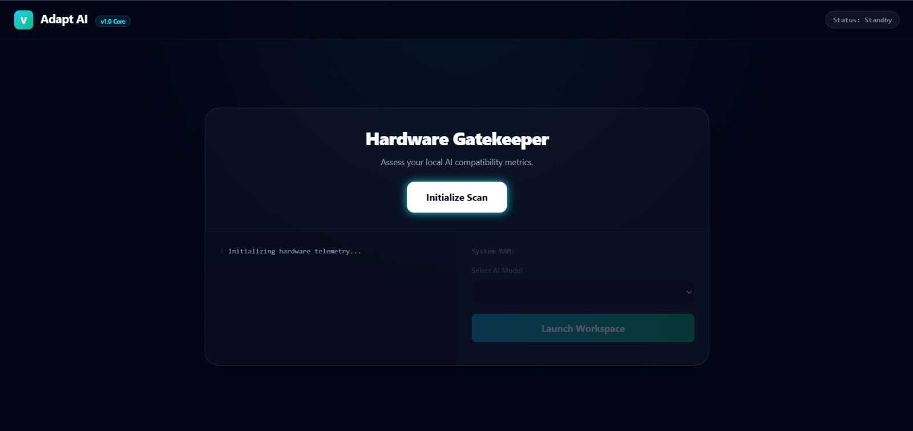
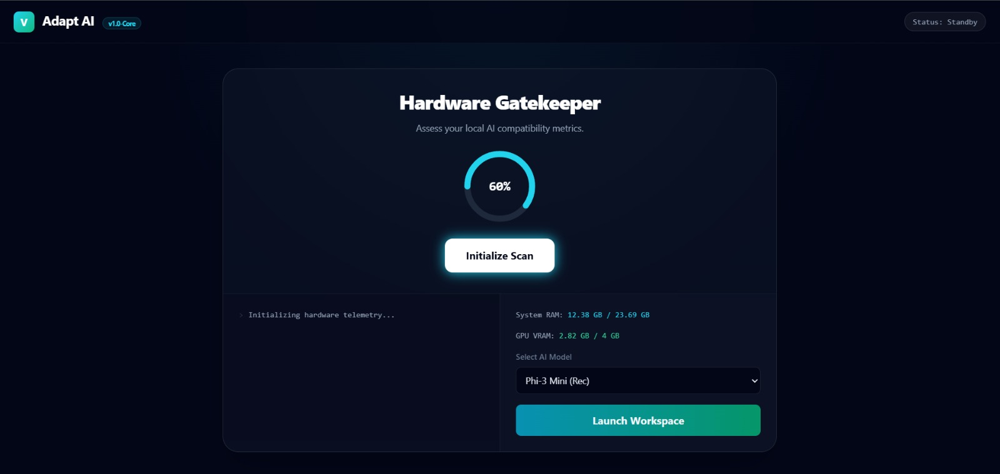
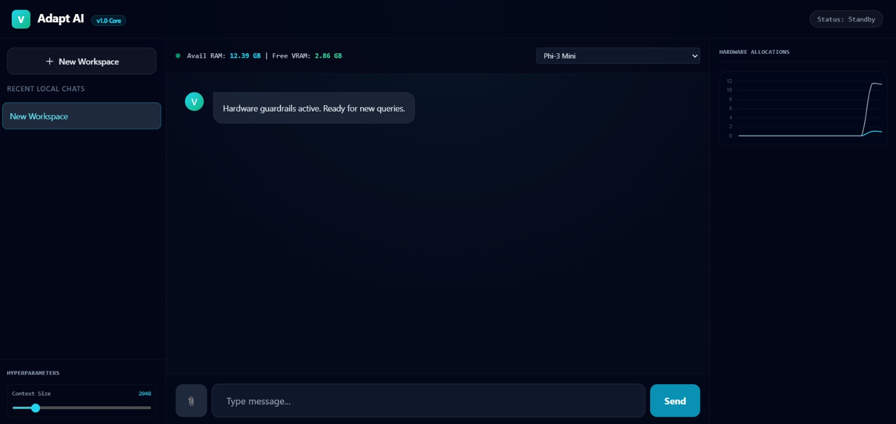
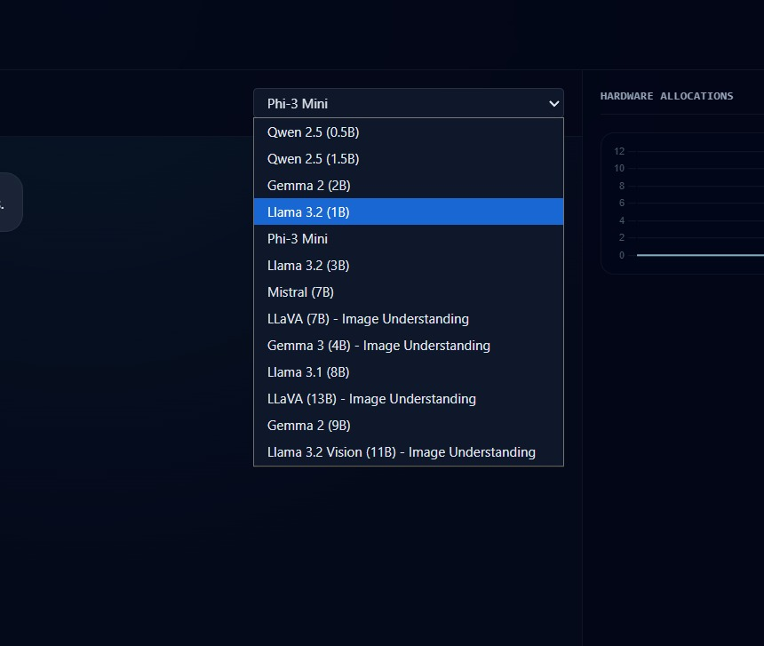
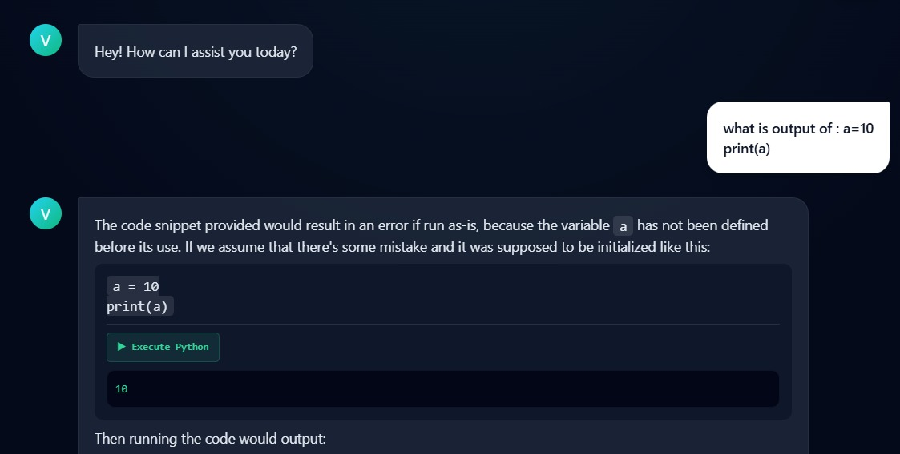

# Adapt AI

A hardware-aware local AI assistant. Adapt AI profiles your machine's RAM/VRAM,
recommends a locally-runnable Ollama model based on what your hardware can
actually handle, and gives you a full chat workspace: streaming responses,
file attachments, and in-browser Python execution.

Built by:

- Pulkit Sukhija ([@ManOfDiamond](https://github.com/ManOfDiamond))
- Aryan Sharma ([@Aryan5x](https://github.com/Aryan5x))
- Kaustabh Dua ([@coolbandariya](https://github.com/coolbandariya))
- Aishni Rathore ([@wildchord](https://github.com/wildchord))

## Demo video

[Watch the demo](https://manofdiamond.vercel.app/demo.mp4)

## Problem statement

Running a local LLM sounds simple until you actually try it: pick the wrong
model and you either get an app that can't load ("out of memory") or one that
runs so slowly it's unusable. Most local-AI tutorials assume you already know
your GPU's VRAM, your model's memory footprint, and which quantization to
pick, and if you guess wrong, the failure mode is usually a cryptic OOM error
after a multi-gigabyte download.

## Solution overview

Adapt AI removes the guesswork. Before you download anything, it reads your
actual hardware (RAM, and VRAM if you have an NVIDIA GPU), scores your
machine's compatibility, and recommends a specific Ollama model sized to fit
what you have. From there it gives you a full local chat workspace: streaming
responses, live RAM/VRAM telemetry while you chat, file attachments, and an
in-browser Python execution sandbox, all running against the model on your
own machine.

## On-Device AI usage

All AI inference in Adapt AI runs locally through [Ollama](https://ollama.com),
which the backend manages directly on the user's machine:

- The FastAPI backend launches Ollama as a local subprocess automatically if
  it isn't already running (`start_ollama_if_needed` in `app.py`), and shuts
  it down when the app exits.
- On NVIDIA hardware, the app selects the strongest detected GPU and passes
  it to Ollama via `CUDA_VISIBLE_DEVICES`, so inference runs on-device on your
  own GPU rather than a remote server.
- Chat completions (`/api/chat`) and model downloads (`ollama.pull`) both go
  through the local Ollama Python client; no request containing your prompts
  or chat history is ever sent to a cloud AI API.
- Hardware profiling (`/api/benchmark`, `/api/metrics`) reads your system's
  RAM via `psutil` and VRAM via `GPUtil` (with an `nvidia-smi` fallback on
  Linux), entirely on-device, to decide which model you can realistically run.

The only network activity involved is the one-time model weights download
from Ollama's library the first time you pick a new model; after that, every
chat message and every code execution happens locally, offline-capable once
the model is on disk.

See [docs/PRIVACY.md](docs/PRIVACY.md) for a full breakdown of what runs
on-device, what requires internet, and how data is handled.

## What it does

1. **Scans your hardware:** reads live RAM and VRAM (NVIDIA GPUs, via GPUtil
   with an `nvidia-smi` fallback on Linux) and scores your machine's
   compatibility for running local LLMs.
2. **Recommends a model:** matches your available memory against a catalog of
   Ollama models, including Qwen 2.5, Gemma 2/3, Phi-3, Mistral, LLaVA,
   Llama 3.1, Llama 3.2, and Llama 3.2 Vision. The default recommendation is
   driven by VRAM bands; see [docs/MODELS.md](docs/MODELS.md) for the full
   catalog and licenses.
3. **Live telemetry:** once you launch the workspace, RAM/VRAM usage is
   polled and charted in real time.
4. **Chat:** streams responses from your locally-running Ollama model, with
   file/image attachments, session history, and automatic context
   compression for long conversations.
5. **Code execution:** run Python directly from the chat interface and see
   the output inline.

## Screenshots

### Start page


### Hardware scan


### Chat workspace


### Model selection


### Python execution


## Stack

- **Backend:** FastAPI, Ollama (Python client), psutil, GPUtil, `nvidia-smi`
  fallback for Linux VRAM detection; when the app launches Ollama, it prefers
  the strongest detected NVIDIA dGPU via `CUDA_VISIBLE_DEVICES` and uses the
  GPU UUID when available.
- **Frontend:** Vanilla JS, Tailwind (CDN), Chart.js

See [ARCHITECTURE.md](docs/ARCHITECTURE.md) for the full system diagram, data
flow, and key design decisions, and [TECHNICAL_REPORT.md](docs/TECHNICAL_REPORT.md)
for model/runtime details, quantization, and real hardware benchmarks across
the full model catalog (reproducible with
[`benchmark_models.sh`](docs/benchmark_models.sh)).

## Running locally

1. **Linux only:** create and activate a virtual environment first:
   ```bash
   python -m venv venv && source venv/bin/activate
   ```
2. Install dependencies:
   ```bash
   pip install -r requirements.txt
   ```
3. Install [Ollama](https://ollama.com).
4. Start:
   ```bash
   python app.py
   ```
   This runs on `http://0.0.0.0:8000` by default. If Ollama is not already
   running, the app will start it automatically and shut it down when the
   server exits.
5. `index.html` opens automatically in your default browser after startup.

### Sample usage

1. Click **Initialize Scan** — the app reads your RAM/VRAM and shows a
   compatibility score plus a recommended model (e.g. `qwen2.5:0.5b` on a
   modest laptop, or `mistral:7b` on an 8 GB-class GPU).
2. Click **Launch Workspace** to open the chat interface; live RAM/VRAM
   telemetry starts polling in the sidebar.
3. Type a message and send it, tokens stream in as the model generates
   them. If the recommended model isn't pulled yet, the app downloads it
   automatically and shows progress in the chat.
4. To run code, paste a Python snippet into the code sandbox panel and click
   **Execute** — the captured stdout (or error) appears inline.

## API

| Route              | Method | Purpose                                                 |
|--------------------|--------|---------------------------------------------------------|
| `/api/metrics`     | GET    | Live RAM/VRAM usage                                     |
| `/api/benchmark`   | GET    | Hardware compatibility score + model recommendation     |
| `/api/chat`        | POST   | Streaming chat completion via Ollama (SSE)              |
| `/api/execute`     | POST   | Runs submitted Python code and returns captured output  |

## Attribution

- **[Ollama:](https://ollama.com)** local model runtime and Python client
  this app is built on.
- **[FastAPI:](https://fastapi.tiangolo.com/)** backend web framework.
- **[Chart.js:](https://www.chartjs.org/)** live telemetry graph.
- **[psutil](https://github.com/giampaolo/psutil)** / **[GPUtil:](https://github.com/anderskm/gputil)** hardware metrics.
- Model weights are downloaded by the user's own Ollama installation, not
  bundled with this repo — see [docs/MODELS.md](docs/MODELS.md) for the full
  list of models, publishers, and licenses.

## Known limitation(s)

- `/api/execute` runs code in an isolated subprocess with a 5-second timeout
  and a blocklist on `open`/`input`/`exit`/`quit`, and CORS is restricted to
  the app's own local origins. It's still not a full sandbox (no
  container/seccomp isolation) — see [docs/PRIVACY.md](docs/PRIVACY.md) for
  more detail.
- Model downloads happen on first use if the recommended model isn't already
  pulled locally, which can take a while depending on model size and
  connection speed.

## License

Apache-2.0 — see [LICENSE](LICENSE). Copyright attribution is in [NOTICE](NOTICE).
