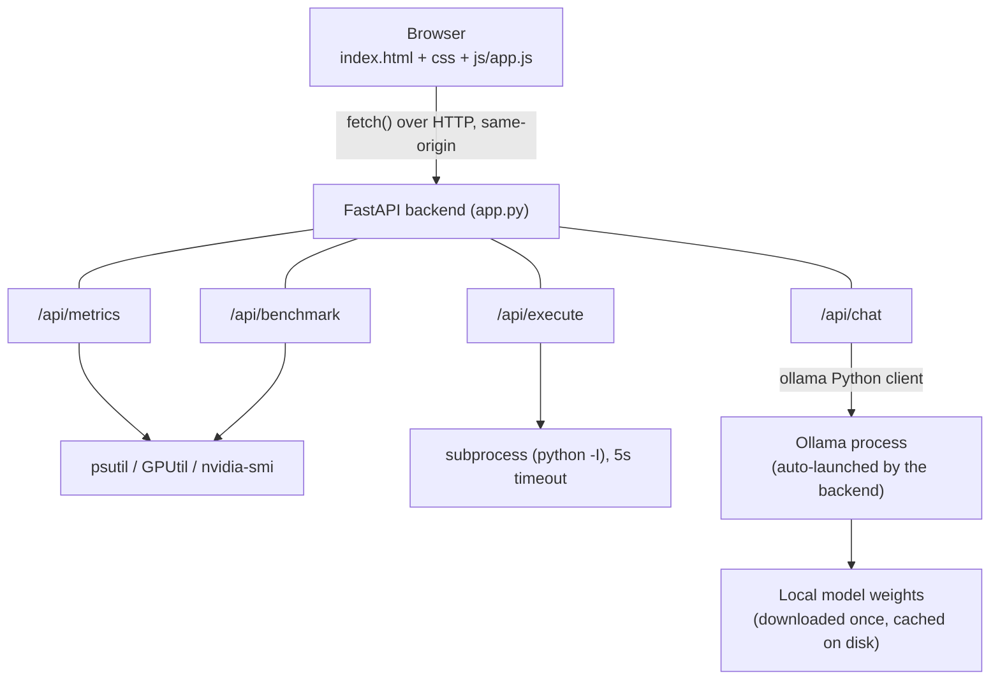

# Architecture

## Overview

Adapt AI is a two-tier local application: a vanilla JS/HTML/CSS frontend
talking to a FastAPI backend over HTTP, with the backend managing a local
Ollama process for all AI inference. There is no cloud AI component, the
backend either talks to Ollama on `localhost`, or reads the host machine's
own hardware stats.

*(If Mermaid doesn't render properly, see the plain-text version in
[docs/ARCHITECTURE_DIAGRAM.txt](ARCHITECTURE_DIAGRAM.txt).)*

## Components

### Frontend (`index.html`, `css/style.css`, `js/app.js`)

Static files, no build step or framework. `js/app.js` is organized around
three UI phases:

1. **Scan:** `scanBtn` calls `/api/benchmark`, renders the compatibility
   score and recommended model.
2. **Workspace launch:** `loadChatBtn` reveals the chat UI and starts a
   `setInterval` poll of `/api/metrics` to drive the live RAM/VRAM chart.
3. **Chat:** the chat form streams from `/api/chat` via Server-Sent Events
   and renders tokens as they arrive; a code-sandbox button in chat messages
   posts to `/api/execute` and displays the captured output.

### Backend (`app.py`)

Single-file FastAPI app, organized into three concerns:

- **Ollama process management:** `is_ollama_running`,
  `start_ollama_if_needed`, `stop_ollama_if_started`,
  `stop_external_ollama_processes`. The backend launches Ollama itself as a
  subprocess on startup if it isn't already running, and shuts it down on
  exit (`atexit`). `get_preferred_cuda_visible_devices` selects the strongest
  detected NVIDIA GPU and passes it to Ollama via `CUDA_VISIBLE_DEVICES`, so
  inference runs on that GPU rather than defaulting to CPU or the wrong card
  on multi-GPU machines.
- **Hardware profiling:** `get_memory_stats` (RAM via `psutil`, VRAM via
  `GPUtil` with an `nvidia-smi` fallback on Linux), `calculate_compatibility_score`,
  and `recommend_model_for_vram`, exposed via `/api/benchmark` and
  `/api/metrics`.
- **AI functionality:** `/api/chat` streams from Ollama via Server-Sent
  Events, with `compress_context_safeguard` trimming conversation history
  once it grows past a token estimate, to avoid overflowing the model's
  context window on long sessions. `/api/execute` runs user-submitted Python
  in an isolated subprocess (`python -I`) with a 5-second timeout and a
  blocklist on a few dangerous builtins (see README's Known Limitations for
  the exact scope of this protection).

## Data flow: a chat message, end to end

1. User types a message and submits the chat form.
2. `js/app.js` POSTs the full message history to `/api/chat`.
3. `compress_context_safeguard` trims the history if it's grown too long.
4. The backend checks whether the selected model is already pulled
   (`ollama.show`); if not, it streams pull progress back to the frontend
   while downloading.
5. `ollama.chat(..., stream=True)` streams tokens from the local Ollama
   process back through the FastAPI endpoint as Server-Sent Events.
6. `js/app.js` appends each token to the chat UI as it arrives.

At no point does a chat message, a benchmark result, or an executed code
snippet get sent anywhere off the host machine; the only outbound network
call in the whole system is Ollama's one-time model weight download from its
own model library.

## Key design decisions

- **Single backend file.** Given the project's scope (four routes, no
  database, no auth), splitting `app.py` into multiple modules would add
  indirection without a real benefit at this size.
- **SSE over WebSockets for chat streaming.** Chat is one-directional
  (server → client, token by token) once the request is sent, so SSE is
  simpler than a full WebSocket connection and needs no extra client-side
  library.
- **Ollama auto-launch instead of requiring the user to start it manually.**
  Reduces setup friction for anyone trying the project, one `python app.py`
  is enough, rather than "install Ollama, remember to run `ollama serve`
  first."
- **Subprocess isolation for `/api/execute` instead of in-process `exec()`.**
  A separate `python -I` process means a crash, infinite loop, or hostile
  builtin call is contained to a disposable child process, cannot access the
  FastAPI server's own memory or state, and is killed outright if it runs
  past the timeout.
